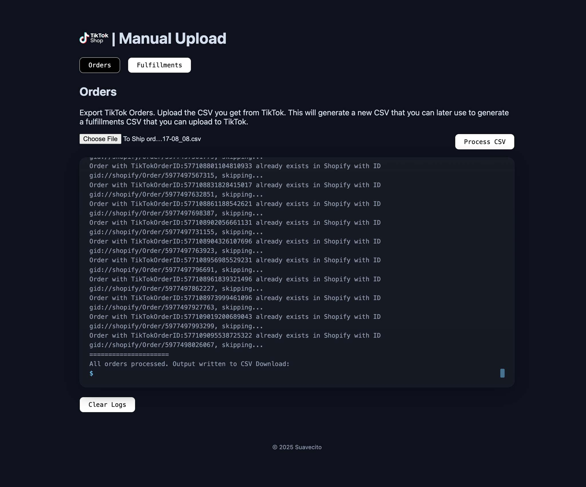

# TikTok - Manual Upload Tool
> A simple React and Express application to to create Shopify orders and generate fulfillments from TikTok Order CSV files.

Features:

- Import TikTok order export CSVs and create corresponding Shopify orders
- Generate TikTok Fulfillment Import CSVs for bulk fulfillment updates
- Support for multiple Shopify fulfillments per order
- Simple, CSV-driven workflow

Use Case: 
- TikTok orders are not syncing to Shopify automatically. This tool helps import those orders into Shopify and generate fulfillment files to update TikTok once the orders are shipped.


<p align="center">
  
</p>
## Setup

Generate a Shopify Admin API Access Token with the following scopes:

- write_customers
- read_customers
- write_discounts
- read_discounts
- write_draft_orders
- read_draft_orders
- write_orders
- read_orders
- read_products

Environmental Variables `.env`

```bash
SHOPIFY_ADMIN_API_VERSION=2025-07
SHOPIFY_STORE=suavecito
SHOPIFY_ACCESS_TOKEN=
```

Generate Types

```bash
npm run type-gen
```

## Build

Client

```bash
cd client
npm run build
```

Server

```bash
cd server
npm run build
```

## Run

```bash
cd server
npm start
```

## Docker Build & Run

```bash
docker build -t tiktok-manual-upload .
docker run -p 3001:3001 --env-file .env tiktok-manual-upload
```